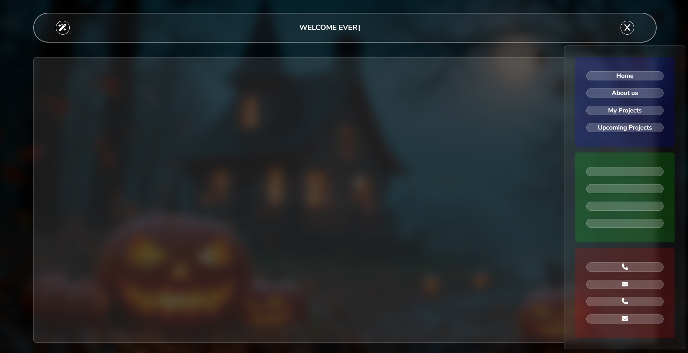

# Glass Morphism Navbar Project

## Description
This project features a responsive navigation bar with a toggle (open/close) functionality. Additionally, the design incorporates a **glass morphism effect**, giving it a modern and aesthetic look.

## Features
- **Navigation Bar**: Toggle functionality to open and close.
- **Glass Morphism**: A frosted glass effect for visually appealing UI.
- **Font Awesome Icons**: Used for icons within the project.
- **Responsive Design**: Works seamlessly across different screen sizes.

## Technology Stack
- **HTML**: For the structure of the webpage.
- **CSS**: For styling and implementing the glass morphism effect.
- **JavaScript**: To add the interactivity for opening and closing the navigation bar.

## File Structure
```plaintext
project-folder/
|-- index.html     # Main HTML file
|-- style.css      # CSS file for styling
|-- script.js      # JavaScript file for interactivity
|-- assets/        # Folder for additional assets like images or fonts
```

## Installation
1. Clone the repository or download the project folder.
2. Open `index.html` in your browser to view the project.

## Future Enhancements
- Add animations for the opening and closing transitions.
- Make the glass morphism effect customizable.
- Include more interactive elements in the navigation menu.

## Preview



## Technologies Used
- HTML
- CSS
- JavaScript

## Font
- [Montserrat Alternates](https://fonts.google.com/specimen/Montserrat+Alternates)

## License
This project is licensed under the MIT License. You are free to use, modify, and distribute it.

---

*Created with ❤️ by [Satyam](https://github.com/Satyam-nitp).*

# 03_Project_WEB-D
